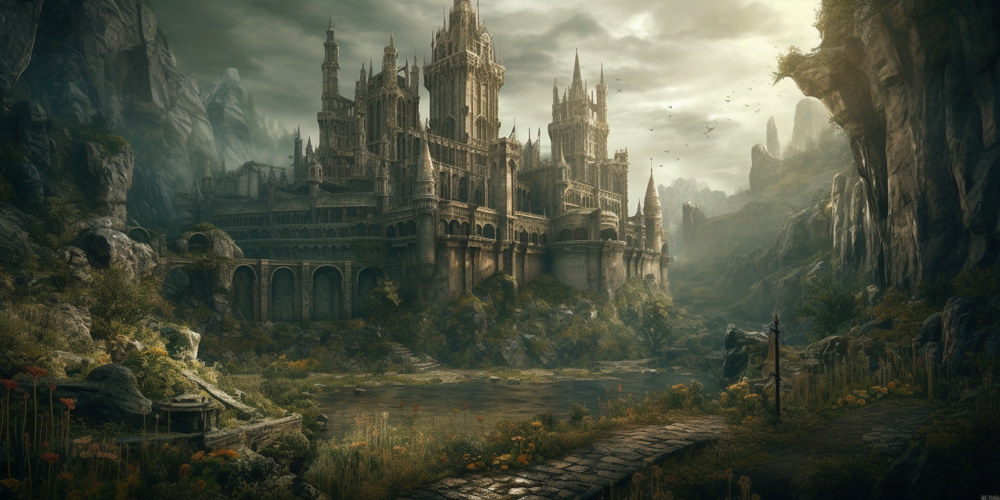

<div align="center">

# 🎮 Carmelo La Mantia | Portfolio

[](https://reactjs.org/)
[](https://getbootstrap.com/)
[](LICENSE)

**Full Stack Developer** | Agrigento, Sicily 🇮🇹

[🌐 Live Demo](https://melolm.github.io/My_Profile) · [💼 LinkedIn](https://www.linkedin.com/in/carmelo-la-mantia-web-developer/) · [📧 Contact](mailto:carmelo.la.mantia00@gmail.com)



</div>

---

## ✨ Features

| Feature | Description |
|---------|-------------|
| 🎬 **Typewriter Effect** | Animated hero text with smooth transitions |
| 🖱️ **Custom Cursor** | Gaming-themed cursor (orange sword) |
| 📊 **Skill Progress Bars** | Animated bars with percentage indicators |
| 🎠 **Skills Carousel** | Auto-scrolling showcase of 14+ technologies |
| 🔥 **Dark Souls Theme** | Loading screen with animated bonfire |
| 🎯 **Easter Egg** | Click the bonfire for "BONFIRE LIT!" |
| 📜 **Horizontal Timeline** | Interactive career journey with navigation |
| 📱 **Fully Responsive** | Optimized for all screen sizes |
| ♿ **Accessible** | ARIA labels and semantic HTML |
| 🚀 **Performance** | Lazy loading and optimized assets |

---

## 🛠️ Tech Stack

<div align="center">


</div>

---

## 🚀 Quick Start

### Prerequisites

- **Node.js** >= 16
- **npm** or **yarn**

### Installation

```bash
# Clone the repository
git clone https://github.com/MeloLM/My_Profile.git

# Navigate to project directory
cd My_Profile

# Install dependencies
npm install

# Start development server
npm start
```

The app will open at `http://localhost:3000`

### Build for Production

```bash
npm run build
```

---

## ⚙️ Configuration

Create a `.env` file in the root directory:

```env
# EmailJS Configuration
REACT_APP_EMAILJS_SERVICE=your_service_id
REACT_APP_EMAILJS_TEMPLATE=your_template_id
REACT_APP_EMAILJS_KEY=your_public_key

# Mailchimp Configuration
REACT_APP_MAILCHIMP_URL=your_mailchimp_url
REACT_APP_MAILCHIMP_U=your_u_value
REACT_APP_MAILCHIMP_ID=your_list_id
```

---

## 📁 Project Structure

```
src/
├── components/
│   ├── layout/          # Navbar, Banner, Footer, Newsletter
│   ├── sections/        # Skills, Projects, Timeline, Contact
│   ├── cards/           # ProjectCard
│   └── common/          # SocialIcons
├── data/
│   └── profileData.js   # Centralized CV data
├── hooks/               # Custom React hooks
├── utils/               # Helper functions
├── styles/              # CSS variables & global styles
└── assets/img/          # Images and icons
```

---

## 🎨 Color Palette

| Color | Value | Usage |
|-------|-------|-------|
| 🟠 Primary | `rgb(224, 136, 33)` | Accent, CTAs, Hover states |
| ⚫ Background | `#121212` | Main background |
| ⬛ Secondary | `rgb(14, 14, 14)` | Cards, sections |
| ⬜ Text | `#FFFFFF` | Primary text |
| 🔘 Muted | `#B8B8B8` | Secondary text |

---

## 📬 Contact

<div align="center">

[](https://www.linkedin.com/in/carmelo-la-mantia-web-developer/)
[](https://github.com/MeloLM)
[](https://www.instagram.com/carmelo_coding)
[](mailto:carmelo.la.mantia00@gmail.com)

</div>

---

## 📄 License

This project is licensed under the MIT License - see the [LICENSE](LICENSE) file for details.

---

<div align="center">

**Made with ❤️ and ☕ by Carmelo La Mantia**

*"Praise the Sun!"* ☀️

</div>  
