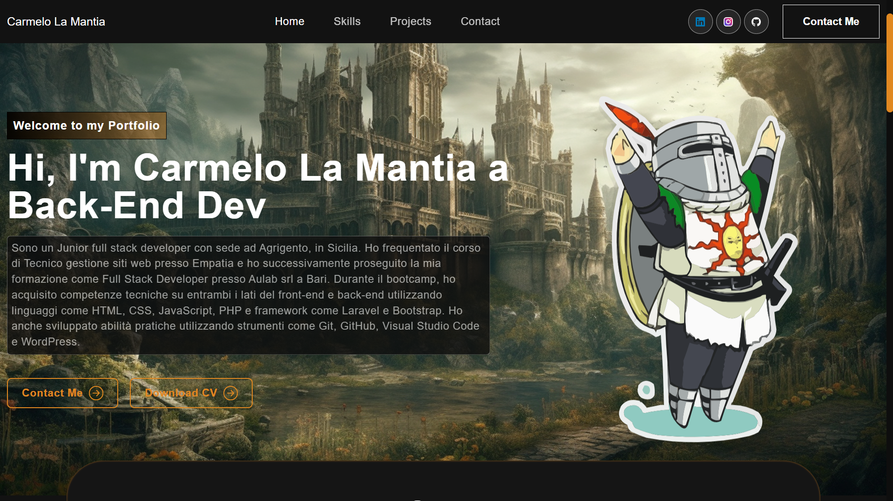

<div align="center">

# 🎮 Carmelo La Mantia | Portfolio

[](https://nextjs.org/)
[](https://reactjs.org/)
[](https://www.typescriptlang.org/)
[](https://getbootstrap.com/)
[](LICENSE)

**Full Stack Developer** | Agrigento, Sicily 🇮🇹

[🌐 Live Demo](https://my-profile-ten-beta.vercel.app) · [💼 LinkedIn](https://www.linkedin.com/in/carmelo-la-mantia-web-developer/) · [📧 Contact](mailto:carmelo.la.mantia00@gmail.com)



</div>

---

## ✨ Features

| Feature | Description |
|---------|-------------|
| ⚡ **Next.js 14 App Router** | Server-side rendering with optimized performance |
| 🖼️ **Automatic Image Optimization** | WebP/AVIF with `next/image` |
| 🎬 **Typewriter Effect** | Animated hero text with smooth transitions |
| 📊 **Skill Progress Bars** | Animated bars with percentage indicators |
| 🎠 **Skills Carousel** | Auto-scrolling showcase with category filters |
| 🔥 **Dark Souls Theme** | Loading screen with animated bonfire |
| 🎮 **Easter Egg** | Bonfire click interaction |
| 📜 **Horizontal Timeline** | Interactive career journey with navigation |
| 📱 **Fully Responsive** | Optimized for all screen sizes |
| ♿ **Accessible** | ARIA labels, semantic HTML, keyboard navigation |
| 🔍 **SEO Optimized** | Metadata API, JSON-LD, sitemap, robots.txt |

---

## 🛠️ Tech Stack

<div align="center">


</div>

---

## 🚀 Quick Start

### Prerequisites

- **Node.js** >= 18
- **npm** or **yarn**

### Installation

```bash
# Clone the repository
git clone https://github.com/MeloLM/My_Profile.git

# Navigate to project directory
cd My_Profile

# Install dependencies
npm install

# Start development server
npm run dev
```

The app will open at `http://localhost:3000`

### Build for Production

```bash
# Create optimized production build
npm run build

# Start production server
npm start
```

---

## ⚙️ Configuration

Create a `.env.local` file in the root directory:

```env
# EmailJS Configuration
NEXT_PUBLIC_EMAILJS_SERVICE=your_service_id
NEXT_PUBLIC_EMAILJS_TEMPLATE=your_template_id
NEXT_PUBLIC_EMAILJS_KEY=your_public_key

# Mailchimp Configuration (optional)
NEXT_PUBLIC_MAILCHIMP_URL=your_mailchimp_url
NEXT_PUBLIC_MAILCHIMP_U=your_u_value
NEXT_PUBLIC_MAILCHIMP_ID=your_list_id
```

---

## 📁 Project Structure

```
src/
├── app/                 # Next.js App Router
│   ├── layout.tsx       # Root layout with Metadata API
│   ├── page.tsx         # Home page entry point
│   ├── robots.ts        # Dynamic robots.txt
│   └── sitemap.ts       # Dynamic sitemap.xml
├── components/
│   ├── layout/          # Navbar, Banner, Footer
│   ├── sections/        # Skills, Projects, Timeline, Contact
│   ├── cards/           # ProjectCard, SkillItem, TimelineItem
│   └── common/          # BackToTop, Loader, WhatsAppFloat, etc.
├── hooks/               # useScroll, useTypewriter, useEmail, useWindowSize
├── data/
│   └── profileData.ts   # Centralized CV data (Single Source of Truth, typed)
├── utils/               # Validators, formatters, logger
├── styles/              # CSS variables & global styles
└── assets/img/          # Images and icons
```

---

## 🎨 Color Palette

Il progetto usa un **tema scuro unico** (nessun theme switcher).

| Color | Value | Usage |
|-------|-------|-------|
| Primary | `#e08821` | Accent, CTAs, Hover states |
| Background | `#121212` | Main background |
| Surface | `#1e1e1e` | Cards, sections |

---

## 🎮 Easter Eggs

- **Bonfire Click**: Click the bonfire in Contact section for "BONFIRE LIT!" animation

---

## 📈 Performance

- ⚡ **Lighthouse Score**: 90+ on all metrics
- 🖼️ **Image Optimization**: Automatic WebP/AVIF with `next/image`
- 📦 **Code Splitting**: Lazy loading with React.lazy + Suspense
- 🗜️ **Bundle Size**: ~132KB First Load JS

---

## 📬 Contact

<div align="center">

[](https://www.linkedin.com/in/carmelo-la-mantia-web-developer/)
[](https://github.com/MeloLM)
[](https://www.instagram.com/carmelo_coding)
[](mailto:carmelo.la.mantia00@gmail.com)

</div>

---

## 📄 License

This project is licensed under the MIT License - see the [LICENSE](LICENSE) file for details.

---

<div align="center">

**Made with ❤️ and ☕ by Carmelo La Mantia**

*"Praise the Sun!"* ☀️

</div>  
